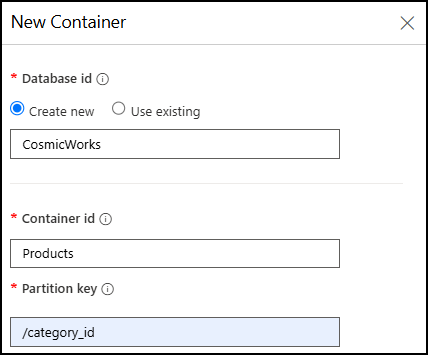
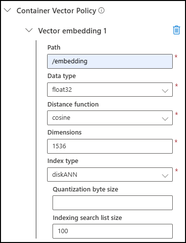

# Enable Vector Search for Azure Cosmos DB for NoSQL

Azure Cosmos DB for NoSQL provides an efficient vector indexing and search capability designed to store and query high-dimensional vectors efficiently and accurately at any scale. To take advantage of this capability, you must enable your account to use the *Vector Search for NoSQL API* feature.

In this lab, you will create an Azure Cosmos DB for NoSQL account and enable the Vector Search feature on it in order to prepare a database for use as a vector store.

## Prepare your development environment

If you have not already cloned the lab code repository for **Build copilots with Azure Cosmos DB** and set up your local environment, view the [Setup local lab environment](00-setup-lab-environment.md) instructions to do so.

## Create an Azure Cosmos DB for NoSQL account

If you already created an Azure Cosmos DB for NoSQL account for the **Build copilots with Azure Cosmos DB** labs on this site, you can use it for this lab and skip ahead to the [next section](#enable-vector-search-for-nosql-api). Otherwise, view the [Setup Azure Cosmos DB](../../common/instructions/00-setup-cosmos-db.md) instructions to create an Azure Cosmos DB for NoSQL account that you will use throughout the lab modules and grant your user identity access to manage data in the account by assigning it to the **Cosmos DB Built-in Data Contributor** role.

## Enable Vector Search for NoSQL API

In this task, you will enable the *Vector Search for NoSQL API* feature in your Azure Cosmos DB account using the Azure CLI.

1. From the toolbar in the [Azure portal](https://portal.azure.com), open a Cloud Shell.

    

2. At the Cloud Shell prompt, ensure your exercise subscription is used for subsequent commands by running `az account set -s <SUBSCRIPTION_ID>`, replacing the `<SUBSCRIPTION_ID>` placeholder token with the id of the subscription you are using for this exercise.

3. Enable the *Vector Search for NoSQL API* feature by executing the following command from the Azure Cloud Shell, replacing the `<RESOURCE_GROUP_NAME>` and `<COSMOS_DB_ACCOUNT_NAME>` tokens with the name of your resource group and Azure Cosmos DB account name, respectively.

     ```bash
     az cosmosdb update \
       --resource-group <RESOURCE_GROUP_NAME> \
       --name <COSMOS_DB_ACCOUNT_NAME> \
       --capabilities EnableNoSQLVectorSearch
     ```

4. Wait for the command to run successfully before exiting the Cloud Shell.

5. Close the Cloud Shell.

## Create a database and container for hosting vectors

1. Select **Data Explorer** from the left-hand menu of your Azure Cosmos DB account in the [Azure portal](https://portal.azure.com), then select **New Container**.

2. In the **New Container** dialog:
   1. Under **Database id**, select **Create new** and enter "CosmicWorks" into the database id field.
   2. In the **Container id** box, enter the name "Products."
   3. Assign "/category_id" as the **Partition key.**

      

   4. Scroll to the bottom of the **New Container** dialog, expand **Container Vector Policy**, and select **Add vector embedding**.

   5. In the **Container Vector Policy** settings section, set the following:

      | Setting | Value |
      | ------- | ----- |
      | **Path** | Enter */embedding*. |
      | **Data type** | Select *float32*. |
      | **Distance function** | Select *cosine*. |
      | **Dimensions** | Enter *1536* to match the number of dimensions produced by OpenAI's `text-embedding-3-small` model. |
      | **Index type** | Select *diskANN*. |
      | **Quantization byte size** | Leave this blank. |
      | **Indexing search list size** | Accept the default value of *100*. |

      

   6. Select **OK** to create the database and container.

   7. Wait for the container to be created before proceeding. It may take several minutes for the container to be ready.
