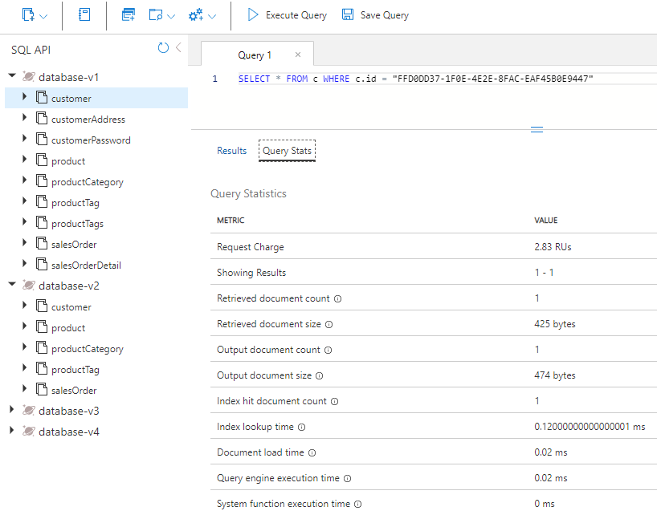
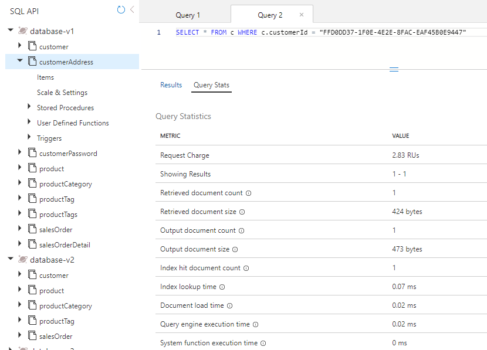
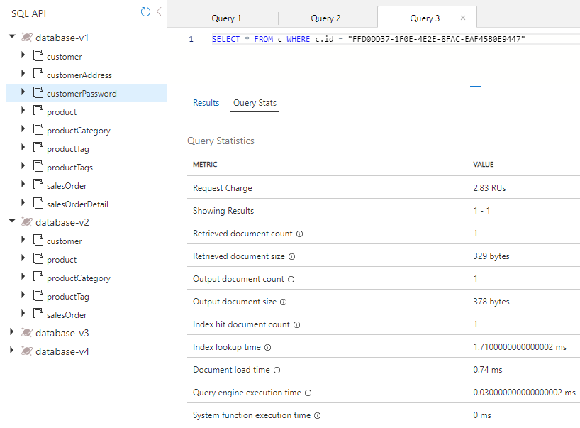
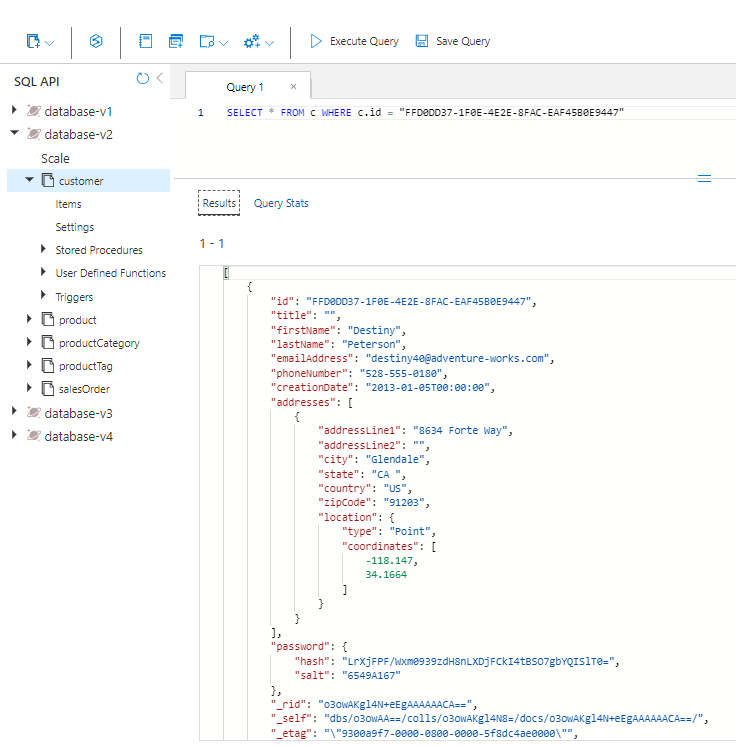

---
lab:
    title: 'Measure performance of entities in separate and embeded containers'
    module: 'Module 8 - Implement a data modeling and partitioning strategy for Azure Cosmos DB SQL API'
---

# Measure performance of entities in separate and embeded containers

In this exercise, you'll measure the difference for customer entities when you model entities as separate containers versus when you model for a NoSQL database by embedding entities in a single document.

## Prepare your development environment

If you have not already cloned the lab code repository for **DP-420** to the environment where you're working on this lab, follow these steps to do so. Otherwise, open the previously cloned folder in **Visual Studio Code**.

1. Start **Visual Studio Code**.

    > &#128221; If you are not already familiar with the Visual Studio Code interface, review the [Get Started guide for Visual Studio Code][code.visualstudio.com/docs/getstarted]

1. Open the command palette and run **Git: Clone** to clone the ``https://github.com/microsoftlearning/dp-420-cosmos-db-dev`` GitHub repository in a local folder of your choice.

    > &#128161; You can use the **CTRL+SHIFT+P** keyboard shortcut to open the command palette.

1. Once the repository has been cloned, open the local folder you selected in **Visual Studio Code**.

1. In **Visual Studio Code**, in the **Explorer** pane, browse to the **16-measure-performance** folder.

1. Open the context menu for the **16-measure-performance** folder and then select **Open in Integrated Terminal** to open a new terminal instance.

1. If the terminal opens as a **Windows Powershell** terminal, open a new **Git Bash** terminal.

    > &#128161; To open a **Git Bash** terminal, on the right hand side of the the terminal menu,click on the pulldown besides the **+** sign and choose *Git Bash*.

1. In the **Git Bash terminal**, run the following commands. The commands open a browser window to connect to the azure portal where you will use the provided lab credentials, run a script that creates a new Azure Cosmos DB account, and then build and start the app you use to populate the database and complete the exercises. *Once the script ask you for the provided credential for the azure account, the build can take 15-20 minutes to finish, so it might be a good time to get some coffee or tea*.

    ```
    az login
    cd 16-measure-performance
    bash init.sh
    dotnet add package Microsoft.Azure.Cosmos --version 3.22.1
    dotnet build
    dotnet run --load-data

    ```

1. Close the integrated terminal.

## Measure performance of entities in separate containers

In Database-v1, data is stored in individual containers. In that database, run queries to get the customer, customer address, and customer password. Review the request charge for each of those queries.

### Query for customer entity

In Database-v1, run a query to get the customer entity and review the request charge.

1. In a new web browser window or tab, navigate to the Azure portal (``portal.azure.com``).

1. Sign into the portal using the Microsoft credentials associated with your subscription.

1. On the Azure portal menu, or from the **Home** page, select **Azure Cosmos DB**.
1. Select the Azure Cosmos DB account with the name that starts with **cosmicworks**.
1. Select **Data Explorer** on the left side.
1. Expand **Database-v1**.
1. Select the **Customer** container.
1. At the top of the screen, select **New SQL Query**.
1. Copy and paste the following SQL text and then select **Execute Query**.

    ```
    SELECT * FROM c WHERE c.id = "FFD0DD37-1F0E-4E2E-8FAC-EAF45B0E9447"
    ```

1. Select the **Query Stats** tab and note the request charge of 2.83.

    

### Query for customer address

Run a query to get the customer address entity and review the request charge.

1. Select the **CustomerAddress** container.
1. At the top of the screen, select **New SQL Query**.
1. Copy and paste the following SQL text and then select **Execute Query**.

    ```
    SELECT * FROM c WHERE c.customerId = "FFD0DD37-1F0E-4E2E-8FAC-EAF45B0E9447"
    ```

1. Select the **Query Stats** tab and note the request charge of 2.83.

    

### Query for customer password

Run a query to get the customer password entity and review the request charge.

1. Select the **CustomerPassword** container.
1. At the top of the screen, select **New SQL Query**.
1. Copy and paste the following SQL text and then select **Execute Query**.

    ```
    SELECT * FROM c WHERE c.id = "FFD0DD37-1F0E-4E2E-8FAC-EAF45B0E9447"
    ```

1. Select the **Query Stats** tab and note the request charge of 2.83.

    

### Add up the request charges

Now that we've run all of our queries, let's add up all of the Request Unit costs for them.

|**Query**|**RU/s cost**|
|---------|---------|
|Customer|2.83|
|Customer Address|2.83|
|Customer Password|2.83|
|**Total RU/s**|**8.49**|

## Measure performance of embedded entities

Now we're going to query for the same information but with the entities embedded in a single document.

1. Select the **Database-v2** database.
1. Select the **Customer** container.
1. Run the following query. 

    ```
    SELECT * FROM c WHERE c.id = "FFD0DD37-1F0E-4E2E-8FAC-EAF45B0E9447"
    ```

1. Observe that the data coming back is now a hierarchy of customer, address, and password data.

    

1. Select **Query Stats**. Note the request charge of 2.83, versus the 8.49 RU/s for the three queries that you ran earlier.

## Compare the performance of the two models

When you compare the RU/s for each query that you ran, you see that the last query where the customer entities are in a single document is much less expensive than the combined cost for running the three queries independently. The latency for returning this data is lower because the data is returned in a single operation.

When you're searching for a single item and know the partition key and ID of the data, you can retrieve this data via a *point-read* by calling `ReadItemAsync()` in the Azure Cosmos DB SDK. A point-read is even faster than our query. For the same customer data, the cost is just 1 RU/s, which is a nearly threefold improvement.

[code.visualstudio.com/docs/getstarted]: https://code.visualstudio.com/docs/getstarted/tips-and-tricks
