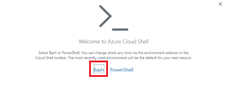
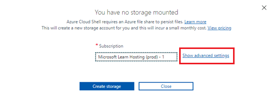

---
lab:
    title: 'Measure performance of entities in separate and embedded containers'
    module: 'Module 8 - Implement a data modeling and partitioning strategy for Azure Cosmos DB SQL API'
---

# Measure performance of entities in separate and embedded containers

In this exercise, you'll measure the difference for customer entities when you model entities as separate containers versus when you model for a NoSQL database by embedding entities in a single document.

## Prepare your development environment

If you haven't already prepared the Azure Cosmos DB database where you're working on this lab, follow these steps to do so. Otherwise, go to the **Measure performance of entities in separate containers** section.

1. In a new web browser window or tab, navigate to the Azure portal (``portal.azure.com``).

1. Sign in using your supplied Azure credentials.

1. In this lab, we'll load the sample data using the Azure Cloud Shell terminal, but before we can do that, the Azure Cloud Shell will need an Azure Storage Account added to it to work. If you don't have a storage account already available, we'll need to create one.  If you already have access to your Azure Cloud Shell, you can skip this step.

    1. Select the option to **Create a resource**.

    1. Search for **Azure Storage**.

    1. Select **Storage account** from the list and select **Create**.

    1. Select the correct *subscription* and *resource group* if not already selected.

    1. Using lower case letters and numbers, choose a unique name for your *storage account name*.  If your resource group name is unique enough, you could use that as your *storage account name* too.  Leave all other options to their default values.

    1. Select **Review + Create**, and once the validation passes, choose **Create**.

1. If your Azure Cloud Shell has already been set up, open it up in **Bash** mode, otherwise, use the following instructions to set it up for the first time.

    

    1. Select the **Azure Cloud Shell** button to open it.

    1. Select **Bash** mode.

        
 
    1. Assuming this is the first time you run the Azure Cloud Shell under this Azure account, you'll need to connect an Azure storage account to this Cloud Shell.  Choose **Show advanced settings** to link the storage account. 

        
 
    1. Choose the correct *subscription* and *region*. Under **Resource Group** and **Storage account**, choose **Use existing** and select the correct resource group and storage account.  Under **File share**, give the share a unique name under that storage account. Select **Create storage** to finish setting up the Cloud Shell.

        
 
1. In the **Azure Cloud Shell Bash terminal**, run the following commands. The commands run a script that creates a new Azure Cosmos DB account, and then build and start the app you use to populate the database and complete the exercises. *The build can take 15-20 minutes to finish, so it might be a good time to get some coffee or tea*.

    ```
    git clone https://github.com/microsoftlearning/dp-420-cosmos-db-dev
    cd dp-420-cosmos-db-dev/16-measure-performance
    bash init.sh
    dotnet add package Microsoft.Azure.Cosmos --version 3.22.1
    dotnet build
    dotnet run --load-data

    ```

1. Close the Cloud Shell terminal.

## Measure performance of entities in separate containers

In Database-v1, data is stored in individual containers. In that database, run queries to get the customer, customer address, and customer password. Review the request charge for each of those queries.

### Query for customer entity

In Database-v1, run a query to get the customer entity and review the request charge.

1. If not already opened, in a new web browser window or tab, navigate to the Azure portal (``portal.azure.com``).

1. Sign into the portal using the Microsoft credentials associated with your subscription.

1. On the Azure portal menu, or from the **Home** page, select **Azure Cosmos DB**.

1. Select the Azure Cosmos DB account with the name that starts with **cosmicworks**.

1. Select **Data Explorer** on the left side.

1. Expand **Database-v1**.

1. Select the **Customer** container.

1. At the top of the screen, select **New SQL Query**.

1. Copy and paste the following SQL text and then select **Execute Query**.

    ```
    SELECT * FROM c WHERE c.id = "FFD0DD37-1F0E-4E2E-8FAC-EAF45B0E9447"
   ```

1. Select the **Query Stats** tab and note the request charge of 2.83.

    

### Query for customer address

Run a query to get the customer address entity and review the request charge.

1. Select the **CustomerAddress** container.

1. At the top of the screen, select **New SQL Query**.

1. Copy and paste the following SQL text and then select **Execute Query**.

    ```
    SELECT * FROM c WHERE c.customerId = "FFD0DD37-1F0E-4E2E-8FAC-EAF45B0E9447"
   ```

1. Select the **Query Stats** tab and note the request charge of 2.83.

    

### Query for customer password

Run a query to get the customer password entity and review the request charge.

1. Select the **CustomerPassword** container.

1. At the top of the screen, select **New SQL Query**.

1. Copy and paste the following SQL text and then select **Execute Query**.

    ```
    SELECT * FROM c WHERE c.id = "FFD0DD37-1F0E-4E2E-8FAC-EAF45B0E9447"
   ```

1. Select the **Query Stats** tab and note the request charge of 2.83.

    

### Add up the request charges

Now that we've run all of our queries, let's add up all of the Request Unit costs for them.

|**Query**|**RU/s cost**|
|---------|---------|
|Customer|2.83|
|Customer Address|2.83|
|Customer Password|2.83|
|**Total RU/s**|**8.49**|

## Measure performance of embedded entities

Now we're going to query for the same information but with the entities embedded in a single document.

1. Select the **Database-v2** database.

1. Select the **Customer** container.

1. Run the following query.

    ```
    SELECT * FROM c WHERE c.id = "FFD0DD37-1F0E-4E2E-8FAC-EAF45B0E9447"
   ```

1. Observe that the data coming back is now a hierarchy of customer, address, and password data.

    

1. Select **Query Stats**. Note the request charge of 2.83, versus the 8.49 RU/s for the three queries that you ran earlier.

## Compare the performance of the two models

When you compare the RU/s for each query that you ran, you see that the last query where the customer entities are in a single document is much less expensive than the combined cost for running the three queries independently. The latency for returning this data is lower because the data is returned in a single operation.

When you're searching for a single item and know the partition key and ID of the data, you can retrieve this data via a *point-read* by calling `ReadItemAsync()` in the Azure Cosmos DB SDK. A point-read is even faster than our query. For the same customer data, the cost is just 1 RU/s, which is a nearly threefold improvement.
